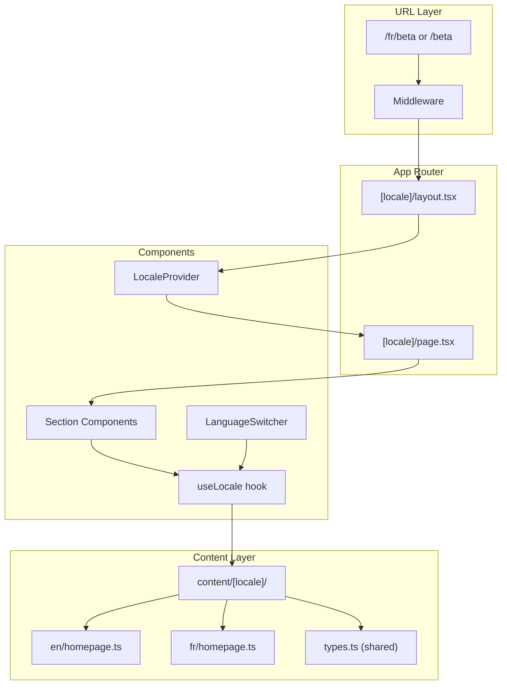

# Design Document: i18n Support

## Overview

This design implements internationalization (i18n) for the Koeo marketing website, supporting English (default) and French. The approach uses Next.js App Router's built-in i18n capabilities with a locale-prefixed URL strategy (`/fr/...` for French, no prefix for English) while maintaining the existing content layer architecture.

The design prioritizes:
- Type-safe translations with compile-time checking
- Minimal changes to existing component structure
- SEO-friendly locale handling with proper hreflang tags
- Developer experience consistent with current patterns

## Architecture



## Components and Interfaces

### Locale Configuration

```typescript
// lib/i18n/config.ts
export const i18nConfig = {
  defaultLocale: "en" as const,
  locales: ["en", "fr"] as const,
  localeNames: {
    en: "English",
    fr: "Français",
  },
} as const;

export type Locale = (typeof i18nConfig.locales)[number];
```

### Middleware for Locale Detection

```typescript
// middleware.ts
import { NextRequest, NextResponse } from "next/server";
import { i18nConfig, Locale } from "@/lib/i18n/config";

export function middleware(request: NextRequest) {
  const pathname = request.nextUrl.pathname;
  
  // Check if pathname has a supported locale
  const pathnameHasLocale = i18nConfig.locales.some(
    (locale) => pathname.startsWith(`/${locale}/`) || pathname === `/${locale}`
  );
  
  if (pathnameHasLocale) return NextResponse.next();
  
  // For default locale (en), don't redirect - serve directly
  // This keeps English URLs clean without /en prefix
  return NextResponse.next();
}

export const config = {
  matcher: ["/((?!api|_next/static|_next/image|favicon.ico|.*\\..*).*)"],
};
```

### Locale Context Provider

```typescript
// lib/i18n/locale-context.tsx
"use client";

import { createContext, useContext, ReactNode } from "react";
import { Locale, i18nConfig } from "./config";

interface LocaleContextValue {
  locale: Locale;
  isDefaultLocale: boolean;
}

const LocaleContext = createContext<LocaleContextValue>({
  locale: i18nConfig.defaultLocale,
  isDefaultLocale: true,
});

export function LocaleProvider({ 
  locale, 
  children 
}: { 
  locale: Locale; 
  children: ReactNode;
}) {
  return (
    <LocaleContext.Provider value={{ 
      locale, 
      isDefaultLocale: locale === i18nConfig.defaultLocale 
    }}>
      {children}
    </LocaleContext.Provider>
  );
}

export function useLocale() {
  return useContext(LocaleContext);
}
```

### Content Retrieval Hook

```typescript
// lib/i18n/use-content.ts
import { useLocale } from "./locale-context";
import { getContent } from "@/content";

export function useContent<T>(contentKey: string): T {
  const { locale } = useLocale();
  return getContent<T>(contentKey, locale);
}
```

### Language Switcher Component

```typescript
// components/ui/language-switcher.tsx
"use client";

import { usePathname } from "next/navigation";
import Link from "next/link";
import { useLocale } from "@/lib/i18n/locale-context";
import { i18nConfig, Locale } from "@/lib/i18n/config";
import { getLocalizedPath } from "@/lib/i18n/utils";

export function LanguageSwitcher() {
  const pathname = usePathname();
  const { locale: currentLocale } = useLocale();
  
  return (
    <div className="flex gap-2">
      {i18nConfig.locales.map((locale) => (
        <Link
          key={locale}
          href={getLocalizedPath(pathname, locale)}
          className={locale === currentLocale ? "font-bold" : ""}
          hrefLang={locale}
        >
          {i18nConfig.localeNames[locale]}
        </Link>
      ))}
    </div>
  );
}
```

### URL Utility Functions

```typescript
// lib/i18n/utils.ts
import { i18nConfig, Locale } from "./config";

/**
 * Generates a localized path from a pathname and target locale
 */
export function getLocalizedPath(pathname: string, locale: Locale): string {
  // Remove any existing locale prefix
  const pathWithoutLocale = removeLocalePrefix(pathname);
  
  // For default locale, return path without prefix
  if (locale === i18nConfig.defaultLocale) {
    return pathWithoutLocale || "/";
  }
  
  // For other locales, add prefix
  return `/${locale}${pathWithoutLocale}`;
}

/**
 * Removes locale prefix from pathname
 */
export function removeLocalePrefix(pathname: string): string {
  for (const locale of i18nConfig.locales) {
    if (pathname.startsWith(`/${locale}/`)) {
      return pathname.slice(locale.length + 1);
    }
    if (pathname === `/${locale}`) {
      return "/";
    }
  }
  return pathname;
}

/**
 * Extracts locale from pathname
 */
export function getLocaleFromPath(pathname: string): Locale {
  for (const locale of i18nConfig.locales) {
    if (pathname.startsWith(`/${locale}/`) || pathname === `/${locale}`) {
      return locale;
    }
  }
  return i18nConfig.defaultLocale;
}

/**
 * Parses Accept-Language header to find best matching locale
 */
export function parseAcceptLanguage(header: string | null): Locale | null {
  if (!header) return null;
  
  const languages = header
    .split(",")
    .map((lang) => {
      const [code, qValue] = lang.trim().split(";q=");
      return {
        code: code.split("-")[0].toLowerCase(),
        quality: qValue ? parseFloat(qValue) : 1,
      };
    })
    .sort((a, b) => b.quality - a.quality);
  
  for (const { code } of languages) {
    if (i18nConfig.locales.includes(code as Locale)) {
      return code as Locale;
    }
  }
  
  return null;
}
```

## Data Models

### Content Structure

The content layer will be reorganized to support locales while maintaining type safety:

```
content/
├── types.ts              # Shared TypeScript interfaces (unchanged)
├── index.ts              # Content retrieval API
├── en/                   # English content (default)
│   ├── homepage.ts
│   ├── beta.ts
│   ├── about.ts
│   ├── careers.ts
│   └── product.ts
└── fr/                   # French content
    ├── homepage.ts
    ├── beta.ts
    ├── about.ts
    ├── careers.ts
    └── product.ts
```

### Content Index with Fallback

```typescript
// content/index.ts
import { Locale, i18nConfig } from "@/lib/i18n/config";

// Import all locale content
import * as enContent from "./en";
import * as frContent from "./fr";

const contentByLocale: Record<Locale, Record<string, unknown>> = {
  en: enContent,
  fr: frContent,
};

/**
 * Retrieves content for a given key and locale with fallback
 */
export function getContent<T>(key: string, locale: Locale): T {
  const localeContent = contentByLocale[locale];
  const defaultContent = contentByLocale[i18nConfig.defaultLocale];
  
  // Return locale-specific content or fall back to default
  return (localeContent[key] ?? defaultContent[key]) as T;
}
```

### Form Content Types

```typescript
// content/types.ts (additions)
export interface FormLabels {
  submit: string;
  submitting: string;
  success: string;
  error: string;
}

export interface ValidationMessages {
  required: string;
  email: string;
  minLength: (min: number) => string;
  maxLength: (max: number) => string;
}

export interface FormContent {
  labels: Record<string, string>;
  placeholders: Record<string, string>;
  validation: ValidationMessages;
  buttons: FormLabels;
}
```

## Correctness Properties

*A property is a characteristic or behavior that should hold true across all valid executions of a system-essentially, a formal statement about what the system should do. Properties serve as the bridge between human-readable specifications and machine-verifiable correctness guarantees.*

### Property 1: French locale routing
*For any* valid page path with `/fr` prefix, the extracted locale SHALL be "fr" and the path segment SHALL be preserved correctly.
**Validates: Requirements 1.1**

### Property 2: Default locale routing
*For any* valid page path without a locale prefix, the extracted locale SHALL be "en" (default) and the path SHALL remain unchanged.
**Validates: Requirements 1.2**

### Property 3: URL generation preserves path across locales
*For any* pathname and target locale, `getLocalizedPath` SHALL preserve the path segment while correctly adding or removing the locale prefix.
**Validates: Requirements 2.1, 2.2**

### Property 4: HTML lang attribute matches locale
*For any* supported locale, when that locale is active, the HTML lang attribute value SHALL equal the locale code.
**Validates: Requirements 2.3**

### Property 5: Translation fallback to English
*For any* content key and locale, if the translation is missing for that locale, the system SHALL return the English (default) content instead of undefined.
**Validates: Requirements 3.2**

### Property 6: Hreflang tags present for all locales
*For any* rendered page, the hreflang link tags SHALL include entries for all supported locales with correct href values.
**Validates: Requirements 4.1**

### Property 7: Locale-aware metadata generation
*For any* page and locale combination, the generated Open Graph locale tag SHALL match the current locale format (e.g., "en_US", "fr_FR").
**Validates: Requirements 4.2**

### Property 8: Sitemap includes all locale variants
*For any* page in the sitemap, there SHALL be URL entries for all supported locales with appropriate xhtml:link hreflang annotations.
**Validates: Requirements 4.3**

### Property 9: Accept-Language header parsing
*For any* valid Accept-Language header string, `parseAcceptLanguage` SHALL return the highest-priority locale that matches a supported locale, or null if none match.
**Validates: Requirements 5.1**

### Property 10: Language suggestion banner display
*For any* detected locale that differs from the current locale and matches a supported locale, the language suggestion banner SHALL be displayed.
**Validates: Requirements 5.2**

### Property 11: Form content localization
*For any* form field, validation message, or option label, and *for any* supported locale, the displayed text SHALL match the translation for that locale (or fallback to English).
**Validates: Requirements 7.1, 7.2, 7.3**

## Error Handling

### Missing Translations
- The content retrieval system automatically falls back to English when a translation is missing
- TypeScript will warn at compile time if a locale file is missing required exports
- Console warnings in development mode when fallback is used

### Invalid Locale in URL
- Middleware passes through requests with invalid locale prefixes
- App router 404 handling catches invalid routes
- No redirect loops or infinite loading states

### Accept-Language Parsing Errors
- Malformed headers return null (no suggestion shown)
- Empty headers return null
- Invalid quality values default to 1.0

## Testing Strategy

### Dual Testing Approach

This feature requires both unit tests and property-based tests:

**Unit Tests** verify specific examples:
- Language switcher renders correct links
- Middleware handles edge cases (root path, trailing slashes)
- Content fallback works for specific missing keys

**Property-Based Tests** verify universal properties:
- URL generation is consistent across all path/locale combinations
- Locale extraction is the inverse of locale prefixing
- Accept-Language parsing handles all valid header formats

### Property-Based Testing Library

The project uses **fast-check** (already installed) for property-based testing.

### Test Configuration

- Each property-based test runs a minimum of 100 iterations
- Tests are tagged with format: `**Feature: i18n-support, Property {number}: {property_text}**`
- Each correctness property is implemented by a single property-based test

### Test File Organization

```
lib/i18n/
├── utils.ts
├── utils.test.ts           # Unit + property tests for URL utilities
├── config.ts
├── locale-context.tsx
└── locale-context.test.tsx # Unit tests for context

content/
├── index.ts
└── index.test.ts           # Property tests for content retrieval

components/ui/
├── language-switcher.tsx
└── language-switcher.test.tsx
```
