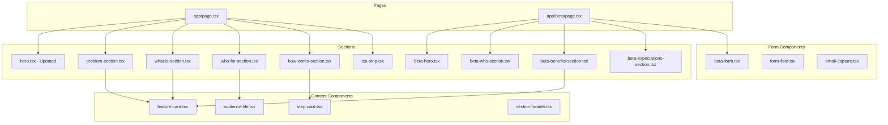

# Design Document: Koeo Content Expansion

## Overview

This design document covers the expansion of the Koeo marketing website with updated homepage content and a new Beta Program page. The implementation builds on the existing design system, component library, and project structure established in the initial marketing website spec.

### Key Additions

- Updated Hero section with new copy, email capture form, and dual CTAs
- Four new homepage sections: Problem, What KOEO Is, Who It's For, How It Works
- CTA Strip section for conversion
- Complete Beta Program page (/beta) with application form
- Reusable content components (FeatureCard, AudienceTile, StepCard)

### Technology Stack (Existing)

- **Next.js 16**: App Router
- **Tailwind CSS 4**: Utility-first styling
- **shadcn/ui**: Component primitives
- **TypeScript**: Type safety
- **Vitest + fast-check**: Testing

## Architecture

### Component Hierarchy



### Updated Project Structure

```
koeo-website/
├── app/
│   ├── layout.tsx
│   ├── page.tsx              # Updated homepage
│   ├── globals.css
│   └── beta/
│       └── page.tsx          # New beta page
├── components/
│   ├── ui/
│   │   ├── button.tsx
│   │   ├── container.tsx
│   │   ├── section.tsx
│   │   ├── feature-card.tsx  # New
│   │   ├── audience-tile.tsx # New
│   │   ├── step-card.tsx     # New
│   │   ├── section-header.tsx # New
│   │   ├── form-field.tsx    # New
│   │   └── ...
│   ├── layout/
│   │   ├── header.tsx
│   │   └── footer.tsx
│   └── sections/
│       ├── hero.tsx          # Updated
│       ├── problem-section.tsx    # New
│       ├── what-is-section.tsx    # New
│       ├── who-for-section.tsx    # New
│       ├── how-works-section.tsx  # New
│       ├── cta-strip.tsx          # New
│       ├── beta-hero.tsx          # New
│       ├── beta-who-section.tsx   # New
│       ├── beta-benefits-section.tsx  # New
│       ├── beta-expectations-section.tsx # New
│       ├── beta-form.tsx          # New
│       └── email-capture.tsx      # New
└── lib/
    ├── utils.ts
    └── validation.ts         # New - form validation
```

## Components and Interfaces

### Content Components

#### FeatureCard Component

```typescript
interface FeatureCardProps {
  title: string;
  description: string;
  icon?: React.ReactNode;
  className?: string;
}
```

Used in: Problem section, What KOEO Is section, Beta Benefits section

#### AudienceTile Component

```typescript
interface AudienceTileProps {
  title: string;
  description: string;
  className?: string;
}
```

Used in: Who KOEO Is For section

#### StepCard Component

```typescript
interface StepCardProps {
  stepNumber: number;
  title: string;
  description: string;
  className?: string;
}
```

Used in: How KOEO Works section

#### SectionHeader Component

```typescript
interface SectionHeaderProps {
  heading: string;
  intro?: string;
  className?: string;
}
```

Used in: All content sections for consistent heading styling

### Form Components

#### FormField Component

```typescript
interface FormFieldProps {
  id: string;
  label: string;
  type?: 'text' | 'email' | 'textarea' | 'select';
  placeholder?: string;
  helperText?: string;
  required?: boolean;
  error?: string;
  options?: Array<{ value: string; label: string }>;
  value: string;
  onChange: (value: string) => void;
  className?: string;
}
```

#### EmailCapture Component

```typescript
interface EmailCaptureProps {
  placeholder?: string;
  buttonText?: string;
  microcopy?: string;
  onSubmit: (email: string) => void;
  className?: string;
}
```

#### BetaForm Component

```typescript
interface BetaFormData {
  name: string;
  email: string;
  company: string;
  role: string;
  useCase: string;
  currentInfra?: string;
  spend?: string;
  priority?: string;
  notes?: string;
}

interface BetaFormProps {
  onSubmit: (data: BetaFormData) => Promise<void>;
  className?: string;
}

type FormState = 'idle' | 'submitting' | 'success' | 'error';
```

### Section Components

#### Updated Hero Component

```typescript
interface HeroProps {
  eyebrow?: string;
  headline?: string;
  subheadline?: string;
  primaryCta?: { text: string; href: string };
  secondaryCta?: { text: string; href: string };
  showEmailCapture?: boolean;
  className?: string;
}

// Defaults
const defaults = {
  eyebrow: 'Closed Beta · Infrastructure for AI',
  headline: 'Run Your AI Models Without Managing GPUs',
  subheadline: 'KOEO is a unified runtime for distributed GPU inference...',
  primaryCta: { text: 'Join the Private Beta', href: '/beta' },
  secondaryCta: { text: 'Read the Whitepaper', href: '/whitepaper.pdf' },
  showEmailCapture: true,
};
```

#### Problem Section

```typescript
interface ProblemSectionProps {
  className?: string;
}

const PROBLEM_CARDS = [
  {
    title: 'Too many moving parts',
    description: 'Model servers, schedulers, GPU pools and billing systems...',
  },
  {
    title: 'Infrastructure steals focus',
    description: 'Product teams lose time debugging nodes, quotas...',
  },
  {
    title: 'Costs are unpredictable',
    description: 'Fragmented GPU usage, spot instances and opaque pricing...',
  },
];
```

#### What Is Section

```typescript
interface WhatIsSectionProps {
  className?: string;
}

const FEATURE_CARDS = [
  {
    title: 'One API instead of many',
    description: 'Use familiar OpenAI-style endpoints...',
  },
  {
    title: 'Federated GPU fabric',
    description: 'Mix marketplace, prosumer and datacenter GPUs...',
  },
  {
    title: 'Built-in reliability and visibility',
    description: 'Automatic health checks, retries and metrics...',
  },
];
```

#### Who For Section

```typescript
interface WhoForSectionProps {
  className?: string;
}

const AUDIENCE_TILES = [
  {
    title: 'SaaS teams adding AI features',
    description: 'Ship chat, copilots and personalization...',
  },
  {
    title: 'AI-native startups with growing bills',
    description: 'Keep control of your models while optimizing...',
  },
  {
    title: 'Agencies and consultancies',
    description: 'Run client workloads on a shared runtime...',
  },
  {
    title: 'Internal platform teams',
    description: 'Offer a stable inference platform to product teams...',
  },
];
```

#### How Works Section

```typescript
interface HowWorksSectionProps {
  className?: string;
}

const STEPS = [
  {
    stepNumber: 1,
    title: 'Point your client at KOEO',
    description: 'Swap your existing OpenAI client or HTTP calls...',
  },
  {
    stepNumber: 2,
    title: 'Choose or bring your model',
    description: 'Use pre-configured open models or register your own...',
  },
  {
    stepNumber: 3,
    title: 'KOEO runs, routes and observes',
    description: 'Requests are scheduled across the federated GPU fabric...',
  },
];
```

#### CTA Strip Section

```typescript
interface CTAStripProps {
  heading?: string;
  body?: string;
  primaryCta?: { text: string; href: string };
  secondaryCta?: { text: string; href: string };
  className?: string;
}
```

### Beta Page Sections

#### Beta Hero

```typescript
interface BetaHeroProps {
  eyebrow?: string;
  title?: string;
  subtitle?: string;
  className?: string;
}
```

#### Beta Who Section

```typescript
interface BetaWhoSectionProps {
  className?: string;
}

const CRITERIA = [
  {
    title: "You're shipping or about to ship AI features",
    description: 'Chat interfaces, copilots, agents...',
  },
  // ...
];
```

#### Beta Benefits Section

```typescript
interface BetaBenefitsSectionProps {
  className?: string;
}

const BENEFITS = [
  {
    title: 'Early access to the runtime',
    description: "Use KOEO's unified inference layer...",
  },
  // ...
];
```

#### Beta Expectations Section

```typescript
interface BetaExpectationsSectionProps {
  className?: string;
}

const EXPECTATIONS = [
  {
    title: 'Staged onboarding',
    description: "We'll start with a short call...",
  },
  // ...
];
```

## Data Models

### Form Validation Schema

```typescript
interface ValidationRule {
  required?: boolean;
  minLength?: number;
  maxLength?: number;
  pattern?: RegExp;
  message: string;
}

interface FieldValidation {
  [fieldName: string]: ValidationRule[];
}

const betaFormValidation: FieldValidation = {
  name: [
    { required: true, message: 'Full name is required' },
    { minLength: 2, message: 'Name must be at least 2 characters' },
  ],
  email: [
    { required: true, message: 'Work email is required' },
    { pattern: /^[^\s@]+@[^\s@]+\.[^\s@]+$/, message: 'Please enter a valid email' },
  ],
  company: [
    { required: true, message: 'Company or project is required' },
  ],
  role: [
    { required: true, message: 'Your role is required' },
  ],
  useCase: [
    { required: true, message: 'Please describe your AI use case' },
    { minLength: 20, message: 'Please provide more detail (at least 20 characters)' },
  ],
};
```

### Priority Options

```typescript
const PRIORITY_OPTIONS = [
  { value: 'cost', label: 'Cost' },
  { value: 'reliability', label: 'Reliability' },
  { value: 'latency', label: 'Latency' },
  { value: 'data-residency', label: 'Data residency / control' },
  { value: 'other', label: 'Other' },
];
```

## Correctness Properties

*A property is a characteristic or behavior that should hold true across all valid executions of a system-essentially, a formal statement about what the system should do. Properties serve as the bridge between human-readable specifications and machine-verifiable correctness guarantees.*

### Property 1: Content components render title and description for all valid inputs

*For any* valid content component data (FeatureCard, AudienceTile, StepCard) with non-empty title and description strings, the rendered output should contain both the title text and description text.

**Validates: Requirements 2.4, 3.4, 4.4, 5.4**

### Property 2: Form validation correctly identifies invalid email formats

*For any* string that does not match a valid email pattern (missing @, missing domain, etc.), the email validation function should return an error.

**Validates: Requirements 10.4**

### Property 3: Form validation prevents submission with empty required fields

*For any* form state where one or more required fields are empty, the validation function should return errors for those fields and prevent submission.

**Validates: Requirements 10.3, 8.5**

### Property 4: Form fields have accessible label associations

*For any* FormField component rendered with an id and label, the rendered output should have a label element with htmlFor matching the input's id attribute.

**Validates: Requirements 10.1**

### Property 5: className prop merges with default classes

*For any* component that accepts a className prop, when a custom className is provided, the rendered element should contain both the default component classes and the custom className.

**Validates: Requirements 9.5**

## Error Handling

### Form Error Handling

- Client-side validation runs on blur and submit
- Server errors display generic message with retry option
- Network errors show offline-friendly message
- Form state preserved on error for easy correction

### Component Error Handling

- Content components render gracefully with empty strings
- Missing optional props use sensible defaults
- Invalid className values are filtered

## Testing Strategy

### Testing Framework (Existing)

- **Unit Testing**: Vitest with React Testing Library
- **Property-Based Testing**: fast-check library
- **Component Testing**: @testing-library/react

### Unit Tests

1. **Content Components**
   - FeatureCard renders title and description
   - AudienceTile renders title and description
   - StepCard renders step number, title, description
   - SectionHeader renders heading and optional intro

2. **Form Components**
   - FormField renders label, input, helper text
   - FormField shows error state correctly
   - EmailCapture handles submission
   - BetaForm validates required fields
   - BetaForm shows success message on submit

3. **Section Components**
   - Each section renders correct content
   - Hero renders all CTAs and form
   - Beta page sections render in order

### Property-Based Tests

Each property-based test will:
- Run a minimum of 100 iterations
- Be tagged with format: `**Feature: koeo-content-expansion, Property {number}: {property_text}**`
- Reference the specific correctness property from this design document

1. **Content Component Rendering** (Property 1)
   - Generate random valid title/description strings
   - Verify both appear in rendered output

2. **Email Validation** (Property 2)
   - Generate random invalid email strings
   - Verify validation returns error

3. **Required Field Validation** (Property 3)
   - Generate form states with various empty required fields
   - Verify validation catches all empty required fields

4. **Label Accessibility** (Property 4)
   - Generate FormField with various ids
   - Verify htmlFor matches id

5. **ClassName Merging** (Property 5)
   - Generate random classNames
   - Verify both default and custom classes present

