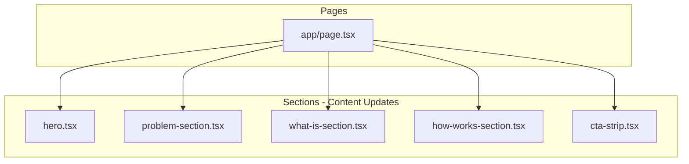

# Design Document: Koeo Copy Refinement

## Overview

This design document covers the copy refinement updates to the Koeo marketing website. The changes align messaging with closed beta reality, ensuring claims are accurate and the beta onboarding process is clearly communicated. All updates modify existing components by updating content constants—no structural changes are required.

### Key Changes

- Hero section: Updated badge, subtitle, and CTA text
- Problem section: Minor copy refinements for clarity
- Platform section: Tightened claims (e.g., "supported models" vs "any model")
- Developer section: Beta-honest messaging about API and dashboard
- Steps section: Replaced instant signup flow with actual beta process
- CTA strip: Updated closing copy

### Technology Stack (Existing)

- **Next.js 16**: App Router
- **Tailwind CSS 4**: Utility-first styling
- **TypeScript**: Type safety
- **Vitest**: Testing

## Architecture

### Affected Components



### Change Strategy

All changes are content-only updates to existing components:

1. **Constants Updates**: Modify `PROBLEM_CARDS`, `FEATURES`, `DEVELOPER_FEATURES`, `STEPS` arrays
2. **Default Props Updates**: Update default values for configurable props
3. **Inline Text Updates**: Update hardcoded strings in JSX

## Components and Interfaces

### Hero Section Updates

No interface changes required. Update content in the component:

```typescript
// Updated content
const HERO_CONTENT = {
  eyebrow: "Closed Beta · Not yet generally available",
  headline: "Run your AI models without managing GPUs",
  subtitle: "KOEO is a unified runtime for distributed GPU inference. We handle the GPU complexity—scheduling, routing and scaling—so you can focus on shipping AI features.",
  primaryCta: { text: "Join the Private Beta", href: "/beta" },
  secondaryCta: { text: "Read the Whitepaper", href: "/whitepaper.pdf" },
  microcopy: "We're gradually inviting teams into the private beta.",
};
```

### Problem Section Updates

Update the `PROBLEM_CARDS` constant:

```typescript
const PROBLEM_CARDS = [
  {
    category: "COMPLEXITY",
    title: "Too many moving parts",
    description: "Model servers, schedulers, GPU pools and billing systems all have to be wired together and kept in sync. Every new component adds configuration, edge cases and failure modes.",
    // ... existing icon/styling
  },
  {
    category: "PRODUCTIVITY",
    title: "Infrastructure steals focus",
    description: "Product teams lose time debugging nodes, quotas and cold starts instead of improving the experience for users. Infra work becomes the default instead of the exception.",
    // ... existing icon/styling
  },
  {
    category: "COST CONTROL",
    title: "Costs are unpredictable",
    description: "Fragmented GPU usage, spot instances and opaque pricing make it hard to forecast spend or decide where to run each workload efficiently.",
    // ... existing icon/styling
  },
];

// Updated intro text
const INTRO_TEXT = "Running inference at scale usually means juggling providers, managing GPU availability, and stitching together tools that weren't designed to work together.";
```

### Platform Section (What Is) Updates

Update the `FEATURES` constant and body text:

```typescript
const FEATURES = [
  {
    icon: /* existing */,
    text: "One API to run your supported models across our federated GPU fabric",
  },
  {
    icon: /* existing */,
    text: "Automatic routing, health checks and basic cost controls across different GPU tiers",
  },
  {
    icon: /* existing */,
    text: "Built-in usage and latency metrics, with deeper observability in active development",
  },
];

const BODY_TEXT = "Instead of wiring together providers, runtimes and custom schedulers, you integrate with a single runtime. KOEO connects your workloads to a federated pool of GPUs and applies routing, health checks and usage tracking for you.";

// Updated CTAs
const PRIMARY_CTA = { text: "Join the Private Beta", href: "/beta" };
const SECONDARY_CTA = { text: "Learn More", href: "/beta" };
```

### Developer Section (How Works) Updates

Update the `DEVELOPER_FEATURES` and `STEPS` constants:

```typescript
const DEVELOPER_FEATURES = [
  {
    title: "OpenAI-compatible API",
    description: "Once you're onboarded to the beta, you'll get OpenAI-style endpoints you can plug into existing clients and SDKs. In most cases you just update the base URL and auth, and keep the rest of your code the same.",
    link: { text: "View API Docs", href: "/docs/api" },
  },
  {
    title: "Early-access dashboard",
    description: "Beta users get access to an evolving dashboard to monitor usage, latency and error rates, and to manage keys and models. We're iterating quickly here, and your feedback directly shapes what we build next.",
    link: { text: "Request Dashboard Access", href: "/beta" },
  },
];

const STEPS = [
  {
    stepNumber: 1,
    title: "Apply for access",
    description: "Tell us about your use case, current setup and constraints. We review applications to make sure the beta is a good fit for what you're building.",
  },
  {
    stepNumber: 2,
    title: "Onboarding & API keys",
    description: "If there's a fit, we'll onboard you, agree on initial limits and give you API keys, example requests and guidance for your first integration.",
  },
  {
    stepNumber: 3,
    title: "Integrate, then scale together",
    description: "Start routing real traffic through KOEO. We'll monitor reliability and performance with you, adjust routing policies and grow capacity as your usage increases.",
  },
];

// Updated section headers
const SECTION_SUBHEADING = "Developer-first experience, even in beta";
const STEPS_HEADING = "How the private beta works";

// Updated CTAs
const STEPS_PRIMARY_CTA = { text: "Apply for Private Beta", href: "/beta" };
const STEPS_SECONDARY_CTA = { text: "Talk to the team", href: "mailto:hello@koeo.ai" };
```

### CTA Strip Updates

Update default props:

```typescript
const DEFAULT_HEADING = "We're in closed beta and onboarding gradually";
const DEFAULT_BODY = "We're working closely with a small group of teams to harden the runtime, scheduler and observability before opening up more broadly. If you're building AI-powered products and want simpler infrastructure, we'd love to talk.";
const DEFAULT_PRIMARY_CTA = { text: "Apply for Private Beta", href: "/beta" };
const DEFAULT_SECONDARY_CTA = { text: "Talk to the team", href: "mailto:hello@koeo.ai" };
```

## Data Models

No data model changes required. All updates are to static content constants.

## Correctness Properties

*A property is a characteristic or behavior that should hold true across all valid executions of a system-essentially, a formal statement about what the system should do. Properties serve as the bridge between human-readable specifications and machine-verifiable correctness guarantees.*

### Analysis

Based on the prework analysis, all acceptance criteria test specific static content rendering. These are best validated as unit test examples rather than property-based tests because:

1. The content is fixed strings, not generated data
2. There's no universal property that applies across varying inputs
3. Each test verifies a specific, known output

**No property-based tests are required for this copy refinement spec.** Unit tests with specific examples are the appropriate testing approach for static content verification.

## Error Handling

No error handling changes required. Existing component error handling remains in place.

## Testing Strategy

### Testing Framework (Existing)

- **Unit Testing**: Vitest with React Testing Library
- **Component Testing**: @testing-library/react

### Unit Tests

Since this is a content-only update, testing focuses on verifying the correct strings render:

1. **Hero Section Tests**
   - Verify eyebrow badge text "Closed Beta · Not yet generally available"
   - Verify headline text
   - Verify subtitle text
   - Verify CTA button text and links

2. **Problem Section Tests**
   - Verify section label "The Challenge"
   - Verify heading text
   - Verify intro paragraph text
   - Verify each card's label, title, and description

3. **Platform Section Tests**
   - Verify section label "The Platform"
   - Verify heading and subheading
   - Verify body paragraph text
   - Verify each feature bullet text
   - Verify CTA text and links

4. **Developer Section Tests**
   - Verify heading "Built by developers, for developers"
   - Verify subheading "Developer-first experience, even in beta"
   - Verify OpenAI-compatible card content
   - Verify dashboard card content and link

5. **Steps Section Tests**
   - Verify heading "How the private beta works"
   - Verify each step's title and description
   - Verify CTA text and links

6. **CTA Strip Tests**
   - Verify heading text
   - Verify body text
   - Verify CTA text and links

### Test Approach

- Use `getByText` and `getByRole` queries to verify content
- Test that links have correct `href` attributes
- Snapshot tests optional for regression detection
