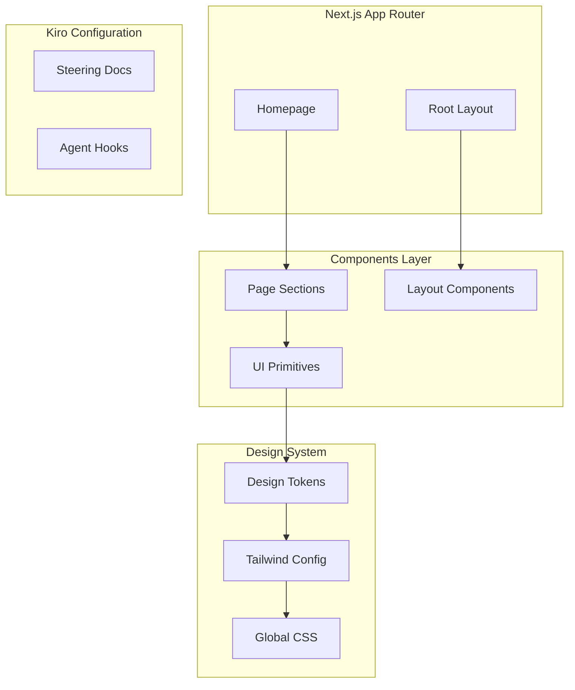

# Design Document: Koeo Marketing Website

## Overview

The Koeo marketing website is a modern, performant Next.js application showcasing an AI inference-first platform. The design prioritizes clean architecture, brand consistency, and developer experience while avoiding over-engineering. Built on Next.js 16 with App Router, Tailwind CSS 4, TypeScript, and shadcn/ui, the website delivers a professional landing page optimized for conversion.

### Key Technology Choices

- **Next.js 16**: App Router for modern React patterns and optimal performance
- **Tailwind CSS 4**: Utility-first styling with design token integration
- **shadcn/ui**: Accessible, customizable component primitives (not a dependency - components are copied into project)
- **TypeScript**: Type safety and better developer experience
- **Vitest + fast-check**: Testing with property-based testing support

## Architecture

### High-Level Architecture



### Project Structure

```
koeo-website/
├── app/
│   ├── layout.tsx          # Root layout with fonts, metadata
│   ├── page.tsx            # Homepage assembly
│   └── globals.css         # Global styles, CSS variables, shadcn theming
├── components/
│   ├── ui/                 # shadcn/ui components (Button, Sheet, etc.)
│   │   ├── button.tsx      # shadcn Button with brand variants
│   │   ├── sheet.tsx       # shadcn Sheet for mobile nav
│   │   ├── navigation-menu.tsx  # shadcn NavigationMenu
│   │   ├── container.tsx   # Custom container component
│   │   └── section.tsx     # Custom section component
│   ├── layout/             # Layout components
│   │   ├── header.tsx
│   │   ├── footer.tsx
│   │   └── mobile-nav.tsx
│   └── sections/           # Page sections
│       └── hero.tsx
├── lib/
│   └── utils.ts            # cn() helper from shadcn/ui
├── public/
│   └── assets/
│       ├── logo.svg        # Koeo logo
│       └── logo-icon.svg   # Koeo icon mark
├── .kiro/
│   ├── steering/
│   │   ├── brand-guidelines.md
│   │   └── coding-standards.md
│   └── hooks/
│       └── hooks.json
├── components.json         # shadcn/ui configuration
└── package.json
```

### shadcn/ui Integration

shadcn/ui components are installed directly into the `components/ui/` directory. This approach:
- Gives full ownership and customization control
- No external runtime dependency
- Components styled with Koeo brand tokens
- Accessible by default (Radix UI primitives)

**Components to install:**
- `button` - Primary CTA and action buttons
- `sheet` - Mobile navigation drawer
- `navigation-menu` - Desktop navigation with dropdowns (optional)

**Configuration (components.json):**
```json
{
  "$schema": "https://ui.shadcn.com/schema.json",
  "style": "new-york",
  "rsc": true,
  "tsx": true,
  "tailwind": {
    "config": "",
    "css": "app/globals.css",
    "baseColor": "slate",
    "cssVariables": true
  },
  "aliases": {
    "components": "@/components",
    "utils": "@/lib/utils"
  }
}
```

## Components and Interfaces

### Design Tokens

```typescript
// Brand Colors
const colors = {
  purple: {
    deep: '#4C1D95',      // Dark accents, depth
    primary: '#7C3AED',   // Main brand color, CTAs
  },
  magenta: '#E02F87',     // Accents, energy, highlights
  pink: {
    light: '#F472B6',     // Hover states, backgrounds
  },
  text: {
    primary: '#0F172A',   // Headings, body text
    light: '#E2E8F0',     // Text on dark backgrounds
  },
};

// Brand Gradients
const gradients = {
  primary: 'linear-gradient(135deg, #7C3AED, #E02F87)',  // Hero, CTAs
  deep: 'linear-gradient(135deg, #4C1D95, #7C3AED)',     // Backgrounds
};

// Typography
const typography = {
  fontFamily: "'Inter', system-ui, -apple-system, 'Segoe UI', sans-serif",
  weights: [400, 500, 600, 700],
};
```

### Component Interfaces

#### Button Component (Extended shadcn/ui)

The Button component extends shadcn/ui's Button with Koeo brand variants:

```typescript
// Based on shadcn/ui Button with custom variants
import { cva, type VariantProps } from "class-variance-authority";

const buttonVariants = cva(
  "inline-flex items-center justify-center rounded-full font-medium transition-all focus-visible:outline-none focus-visible:ring-2 disabled:pointer-events-none disabled:opacity-50",
  {
    variants: {
      variant: {
        default: "bg-gradient-to-r from-purple-primary to-magenta text-white hover:opacity-90",
        secondary: "border border-purple-primary text-purple-primary hover:bg-purple-primary/10",
        ghost: "hover:bg-purple-primary/10 text-purple-primary",
        outline: "border border-input bg-background hover:bg-accent",
      },
      size: {
        sm: "h-9 px-4 text-sm",
        default: "h-11 px-6 text-base",
        lg: "h-14 px-8 text-lg",
      },
    },
    defaultVariants: {
      variant: "default",
      size: "default",
    },
  }
);

interface ButtonProps
  extends React.ButtonHTMLAttributes<HTMLButtonElement>,
    VariantProps<typeof buttonVariants> {
  asChild?: boolean;
}
```

| Variant | Description | Styling |
|---------|-------------|---------|
| default | Main CTA buttons | Brand gradient (purple to magenta), white text, rounded-full |
| secondary | Secondary actions | Purple border, purple text, transparent bg |
| ghost | Tertiary actions | No background, purple text, subtle hover |
| outline | Form buttons | Standard border, background on hover |

| Size | Height | Padding | Font Size |
|------|--------|---------|-----------|
| sm | h-9 | px-4 | text-sm |
| default | h-11 | px-6 | text-base |
| lg | h-14 | px-8 | text-lg |

#### Container Component

```typescript
interface ContainerProps {
  children: React.ReactNode;
  className?: string;
}
```

Constrains content to max-width of 1280px with responsive horizontal padding.

#### Section Component

```typescript
interface SectionProps {
  children: React.ReactNode;
  className?: string;
  background?: 'default' | 'gradient' | 'dark';
}
```

#### Header Component

Uses shadcn/ui Sheet for mobile navigation drawer:

```typescript
interface HeaderProps {
  // No props - uses internal state for mobile menu
}

interface NavItem {
  label: string;
  href: string;
}

const navItems: NavItem[] = [
  { label: 'Product', href: '/product' },
  { label: 'Docs', href: '/docs' },
  { label: 'Pricing', href: '/pricing' },
];
```

**Mobile Navigation (using shadcn Sheet):**
```typescript
// Mobile nav uses Sheet component for slide-out drawer
<Sheet>
  <SheetTrigger asChild>
    <Button variant="ghost" size="sm">
      <Menu className="h-6 w-6" />
    </Button>
  </SheetTrigger>
  <SheetContent side="right">
    {/* Navigation links */}
  </SheetContent>
</Sheet>
```

#### Hero Component

```typescript
interface HeroProps {
  headline?: string;
  subheadline?: string;
  ctaText?: string;
  ctaHref?: string;
}

// Defaults
const defaults = {
  headline: 'Unify Your GPU Infrastructure',
  subheadline: 'The runtime layer that brings fragmented GPUs together into one reliable inference fabric.',
  ctaText: 'Start Building',
  ctaHref: '/get-started',
};
```

#### Footer Component

```typescript
interface FooterLink {
  label: string;
  href: string;
}

interface FooterLinkGroup {
  title: string;
  links: FooterLink[];
}

const footerGroups: FooterLinkGroup[] = [
  {
    title: 'Product',
    links: [
      { label: 'Features', href: '/features' },
      { label: 'Pricing', href: '/pricing' },
      { label: 'Changelog', href: '/changelog' },
    ],
  },
  {
    title: 'Resources',
    links: [
      { label: 'Documentation', href: '/docs' },
      { label: 'API Reference', href: '/api' },
      { label: 'Blog', href: '/blog' },
    ],
  },
  {
    title: 'Company',
    links: [
      { label: 'About', href: '/about' },
      { label: 'Careers', href: '/careers' },
      { label: 'Contact', href: '/contact' },
    ],
  },
];
```

## Data Models

### Navigation Configuration

```typescript
type NavConfig = {
  items: NavItem[];
  cta: {
    label: string;
    href: string;
  };
};
```

### SEO Metadata

```typescript
type SiteMetadata = {
  title: string;
  description: string;
  openGraph: {
    title: string;
    description: string;
    url: string;
    siteName: string;
    images: Array<{
      url: string;
      width: number;
      height: number;
      alt: string;
    }>;
  };
};
```

## Correctness Properties

*A property is a characteristic or behavior that should hold true across all valid executions of a system-essentially, a formal statement about what the system should do. Properties serve as the bridge between human-readable specifications and machine-verifiable correctness guarantees.*

Based on the prework analysis, the following correctness properties have been identified:

### Property 1: Button renders correctly for all valid prop combinations

*For any* valid combination of variant ('primary' | 'secondary' | 'ghost') and size ('sm' | 'md' | 'lg'), the Button component should render without errors and produce a valid React element with appropriate CSS classes applied.

**Validates: Requirements 4.1, 4.2**

### Property 2: Components handle invalid props gracefully

*For any* invalid or undefined prop value passed to UI components (Button, Container, Section), the component should render with default styling without throwing an error or breaking the render tree.

**Validates: Requirements 4.5**

### Property 3: Interactive elements have ARIA attributes

*For any* interactive element (buttons, links, navigation items) rendered by the components, the element should include appropriate ARIA labels or roles for accessibility.

**Validates: Requirements 8.1**

### Property 4: Images have alt text

*For any* image element rendered by the components, the element should include a non-empty alt attribute describing the image content.

**Validates: Requirements 8.2**

### Property 5: Brand color combinations meet contrast requirements

*For any* text-background color combination used in the design system, the contrast ratio should meet WCAG 2.1 AA standards (minimum 4.5:1 for normal text, 3:1 for large text).

**Validates: Requirements 8.3**

## Error Handling

### Component Error Boundaries

- UI components use defensive defaults for all optional props
- Invalid variant/size props fall back to default values
- Missing children render empty but valid elements

### Navigation Error Handling

- Invalid href values default to '#'
- Mobile menu state resets on route change
- External links open in new tab with security attributes

### Image Error Handling

- Logo components include fallback text
- Next.js Image component handles loading states
- Alt text always provided for accessibility

## Testing Strategy

### Testing Framework

- **Unit Testing**: Vitest with React Testing Library
- **Property-Based Testing**: fast-check library for TypeScript
- **Component Testing**: @testing-library/react for DOM assertions

### Dependencies

```json
{
  "dependencies": {
    "next": "16.0.6",
    "react": "19.2.0",
    "react-dom": "19.2.0",
    "class-variance-authority": "^0.7.0",
    "clsx": "^2.1.0",
    "tailwind-merge": "^2.2.0",
    "lucide-react": "^0.400.0",
    "@radix-ui/react-slot": "^1.0.2",
    "@radix-ui/react-dialog": "^1.0.5"
  },
  "devDependencies": {
    "vitest": "^1.0.0",
    "fast-check": "^3.15.0",
    "@testing-library/react": "^14.0.0",
    "@vitejs/plugin-react": "^4.0.0",
    "jsdom": "^24.0.0"
  }
}
```

### Unit Tests

Unit tests verify specific examples and edge cases:

1. **Button Component**
   - Renders with correct text content
   - Applies correct classes for each variant
   - Handles click events
   - Renders as link when href provided

2. **Header Component**
   - Renders logo and navigation items
   - Mobile menu toggles correctly
   - CTA button present with correct styling

3. **Hero Component**
   - Renders headline and subheadline
   - CTA button has correct text and href
   - Background gradient applied

4. **Footer Component**
   - Renders all link groups
   - Copyright includes current year
   - Logo and description present

### Property-Based Tests

Property tests verify universal properties across all inputs:

1. **Button Prop Combinations** (Property 1)
   - Generate all valid variant/size combinations
   - Verify each renders without error
   - Verify appropriate classes applied

2. **Invalid Props Handling** (Property 2)
   - Generate random invalid prop values
   - Verify components render with defaults
   - Verify no errors thrown

3. **Accessibility Attributes** (Properties 3, 4)
   - Verify all interactive elements have ARIA attributes
   - Verify all images have alt text

4. **Color Contrast** (Property 5)
   - Test all brand color combinations
   - Calculate contrast ratios
   - Verify WCAG AA compliance

### Test Configuration

```typescript
// vitest.config.ts
import { defineConfig } from 'vitest/config';
import react from '@vitejs/plugin-react';

export default defineConfig({
  plugins: [react()],
  test: {
    environment: 'jsdom',
    globals: true,
    setupFiles: ['./tests/setup.ts'],
  },
});
```

Each property-based test will:
- Run a minimum of 100 iterations
- Be tagged with format: `**Feature: koeo-marketing-website, Property {number}: {property_text}**`
- Reference the specific correctness property from this design document
